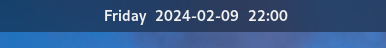
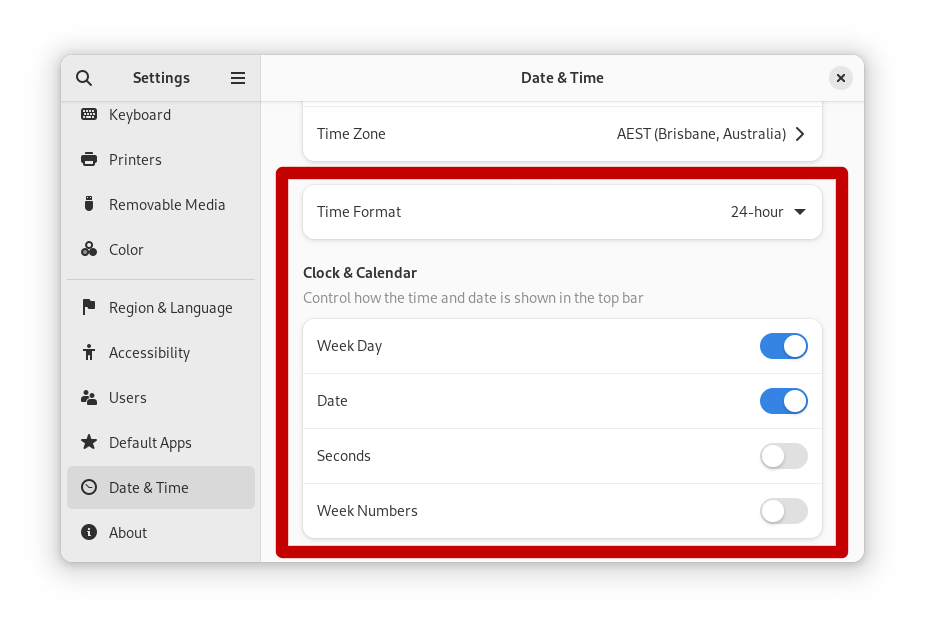

# ISO Clock

> For **Gnome 45+**

ISO Clock is a Gnome extension that changes the clock to an ISO8601 style date 
format (yyyy-mm-dd) 

## Installation

To install, visit the Gnome Extensions website:
<https://extensions.gnome.org/extension/7126/iso-clock/>

## Settings

This extension uses settings from the Gnome Settings app

- Added support for day of the week and AM/PM display based on preferences

<picture>
  <source media="(prefers-color-scheme: dark)" srcset="./media/screenshot2-dark.png">
  
</picture>

## Acknowledgements

This is an update to S410's original 'iso8601ish' clock extension, which can be 
found: [here](https://gitlab.com/S410/iso8601ish)
